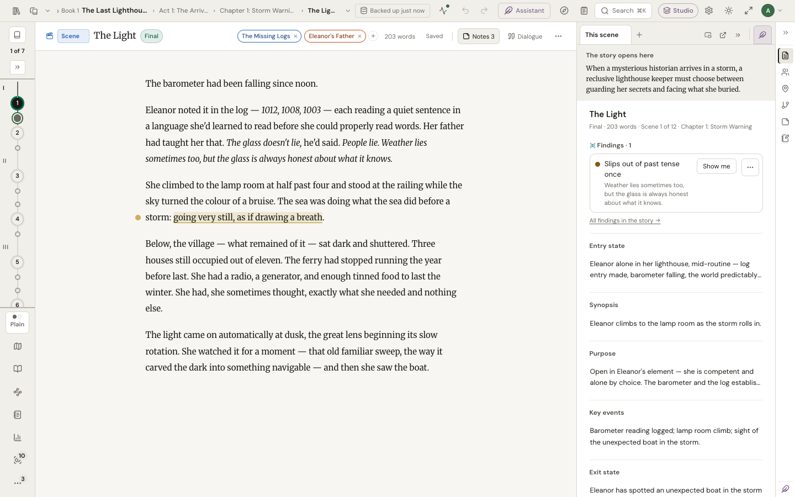
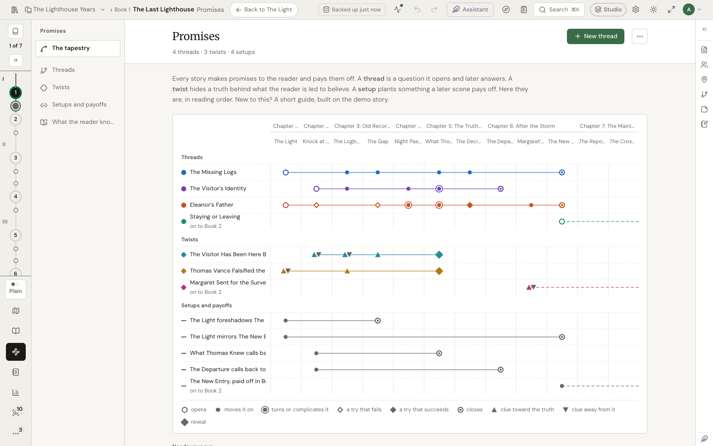

<p align="center">
  
</p>

<h1 align="center">LoreStudio</h1>

<p align="center">
  <strong>Where stories take shape.<br/>A self-hosted workspace for novelists. You write; it helps you see what you are building.</strong>
</p>

<p align="center">
  <a href="#features">Features</a> •
  <a href="#screenshots">Screenshots</a> •
  <a href="#getting-started">Getting started</a> •
  <a href="docs/deployment.md">Deployment</a> •
  <a href="CONTRIBUTING.md">Contributing</a>
</p>

<p align="center">
  
  
  
  
  
  
</p>

---

## Why LoreStudio?

LoreStudio is a writing room you run yourself. It keeps everything a long story accumulates in
one place: the characters and who they are, the places, the threads and twists you have promised
the reader, the plan, the research, the manuscript itself, and the history of all of it. It reads
what you write and tells you what it notices: a name spelled two ways, a thread gone quiet, a
scene that slips out of its tense. Then it gets out of the way.

**It won't write your book for you.** It is not a ghostwriter and it does not generate chapters.
When you ask for help you get questions, analysis and suggestions, never replacement prose. Your
voice stays your voice.

**Your story stays yours.**

- **Local by default.** The optional AI runs on your own [Ollama](https://ollama.com); nothing
  is sent to anyone else's servers, and there is no telemetry.
- **Transparent.** Every AI call is logged in the Chronicle with exactly what was sent and what
  came back. Everything LoreStudio does by itself is listed, scheduled and switchable.
- **AI is optional.** Writer mode removes every AI surface. Characters, plans, findings,
  numbers, export and versions all work without a model.
- **Yours to keep.** One SQLite database in one folder; export to DOCX, EPUB, PDF and more; save
  and compare versions; undo almost anything.

## Screenshots

<p align="center">
  <picture>
    <source media="(prefers-color-scheme: dark)" srcset="docs/images/screenshots/write-dark.png" />
    
  </picture>
  <br/><em>Writing a scene: the story strip on the left, the scene's plan and findings beside the prose.</em>
</p>

<p align="center">
  <picture>
    <source media="(prefers-color-scheme: dark)" srcset="docs/images/screenshots/promises-dark.png" />
    
  </picture>
  <br/><em>Promises: every thread, twist and setup across the book, scene by scene.</em>
</p>

<p align="center"><a href="docs/screenshots.md">See more →</a></p>

## Features

### Lorebook: what is true in your story

- **One sheet for every kind of thing**: characters, places, cultures, systems, eras, calendars,
  each with the fields that matter and nothing else in the way.
- **Who they are**: identity, body and mind, what formed them, and the three questions (what do
  they want, why, what stands in the way). Pronoun and name changes reviewed across the manuscript.
- **Relationships, arcs and milestones**, with a character web and each character's dialogue.
- **Series**: books that share characters, places and world, each book with its own version of
  them, planned from the start or grown book by book.

### Manuscript: the prose

- **A quiet editor** with focus mode, sprints, notes in the margin and a scratch pad.
- **`@Character`, `[[Place]]` and `"…"<Speaker>`** in the prose itself: mentions with hover
  cards, dialogue attributed to whoever says it.
- **The story strip**: the whole book as a line of stops down the side, coloured by status,
  point of view or findings.
- **Any shape**: acts, chapters and scenes or your own levels; flash fiction to multi-book epics;
  beat sheets, the Snowflake method and MICE threads as ways to plan.
- **Freewrite** for loose writing, with any phrase made into a note, a character or a scene.

### Promises: what the reader is waiting for

- **The tapestry**: threads, twists and setups across the book, with what each scene does to them.
- **Twists** with their truth beside what the reader believes and their clues in reading order.
- **What the reader knows**, scene by scene.

### Findings: what needs your eye

- **One feed** for everything the checks notice: name slips (with a one-click fix), prose habits,
  tense and point-of-view slips, quiet threads, absent characters, empty chapters, and the
  Assistant's checks when you run them.
- **Show me the passage**: a finding that quotes your prose opens the scene at those words.
- **Numbers**: words, pacing, who is on the page, dialogue and prose over the whole book, and how
  they change over time.

### Compendium and Chronicle

- **Research** (notes, links, images, diagrams), shared across a series when you want it.
- **The Chronicle**: every conversation, analysis, change and AI call, kept and searchable.
- **Undo** for every change to the story, from any page, and **versions** you can compare and
  restore.

### Assistant (optional, local)

- **Interview your characters**, alone or as a panel, with the character's sheet as their mind.
- **Ask about the story** with `@mentions` for what you mean; get a writing coach on a passage,
  "what if" explorations, scene planning, pacing, continuity and plot-hole checks.
- **Codex**: the story's knowledge graph and semantic index, so the Assistant reads the right
  passages, not the whole book.

## Getting started

### Run it

The all-in-one image needs one port and one folder. With Docker:

```bash
docker run -d --name lorestudio -p 8080:8080 \
  -e ADMIN_PASSWORD='a strong password' \
  -v ./data:/data \
  ghcr.io/brentonmallen1/lorestudio:latest
```

Open <http://localhost:8080> and sign in as `admin`. The demo story, "The Last Lighthouse", shows
how everything is meant to be used. For AI, point `OLLAMA_BASE_URL` at your Ollama and
`ollama pull gemma4`.

**On Unraid**, add `https://github.com/brentonmallen1/LoreStudio` under *Docker → Template
Repositories* and install **lorestudio**; see [docs/unraid.md](docs/unraid.md).

Compose files, reverse proxies, backups and every option: [docs/deployment.md](docs/deployment.md)
and [docs/CONFIGURATION.md](docs/CONFIGURATION.md). Updating: [docs/upgrading.md](docs/upgrading.md).

### Develop it

Requires [uv](https://docs.astral.sh/uv/), Node 22 and [just](https://github.com/casey/just).

```bash
git clone https://github.com/brentonmallen1/LoreStudio.git && cd LoreStudio
just init-env      # .env from .env.example
just setup         # dependencies
just dev           # the app on http://localhost:5173
```

[docs/INSTALLATION.md](docs/INSTALLATION.md) has the details; [CONTRIBUTING.md](CONTRIBUTING.md)
the conventions and quality gates.

## Architecture

| Part | What |
|---|---|
| Backend | Python 3.13, FastAPI, SQLAlchemy, Alembic, SQLite (WAL) |
| Frontend | React 19, TypeScript, TipTap, Zustand, Vite |
| AI | Ollama, built around Gemma 4; every call through one gateway that logs it |
| Local analysis | spaCy for prose checks; `sqlite-vec` for semantic search |
| Background work | Jobs in two lanes (the model's, one call at a time, and local work); automatic work on a schedule |
| Deployment | An all-in-one image (nginx and the API under s6) or two containers; amd64 and arm64 |

## Roadmap

- The Assistant at the level of a whole series.
- Read-only access for other tools through MCP.
- Concept art from your descriptions, with guardrails and provenance.
- Audio narration of the manuscript.

## Contributing

Issues and pull requests are welcome. Start with [CONTRIBUTING.md](CONTRIBUTING.md); `just ci`
runs every check CI does.

## License

[AGPL-3.0](LICENSE). If you run a modified LoreStudio for other people, share your changes.

---

<p align="center">
  <em>Built for writers who do the writing.</em>
</p>
