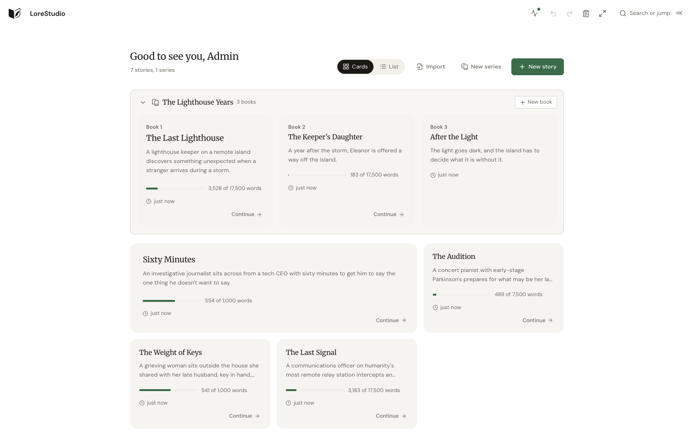
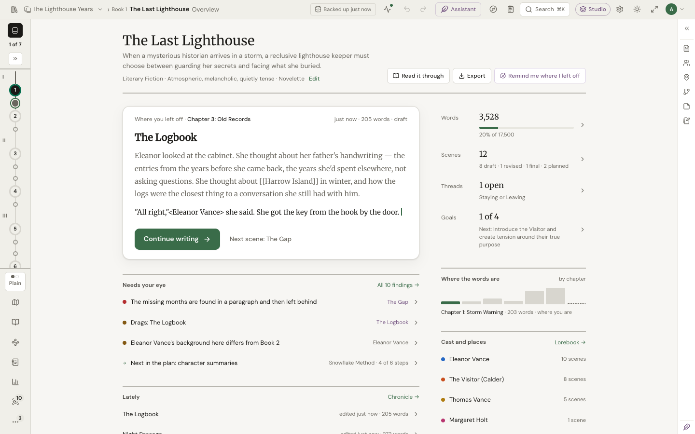
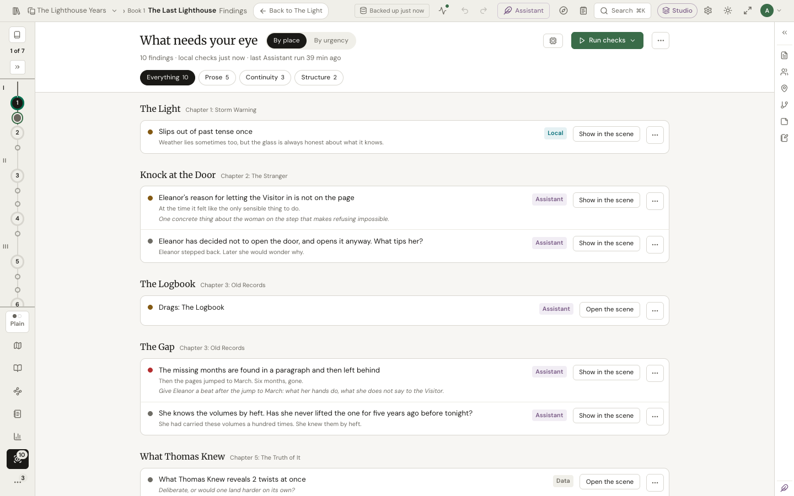
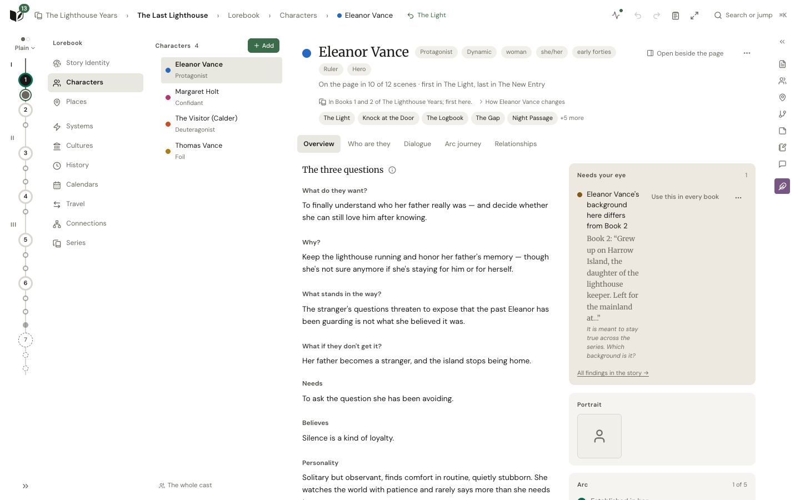
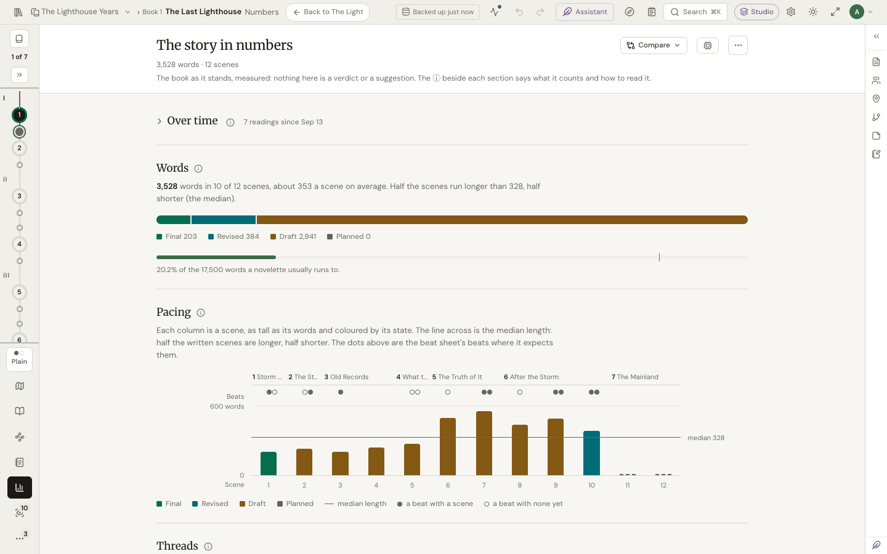
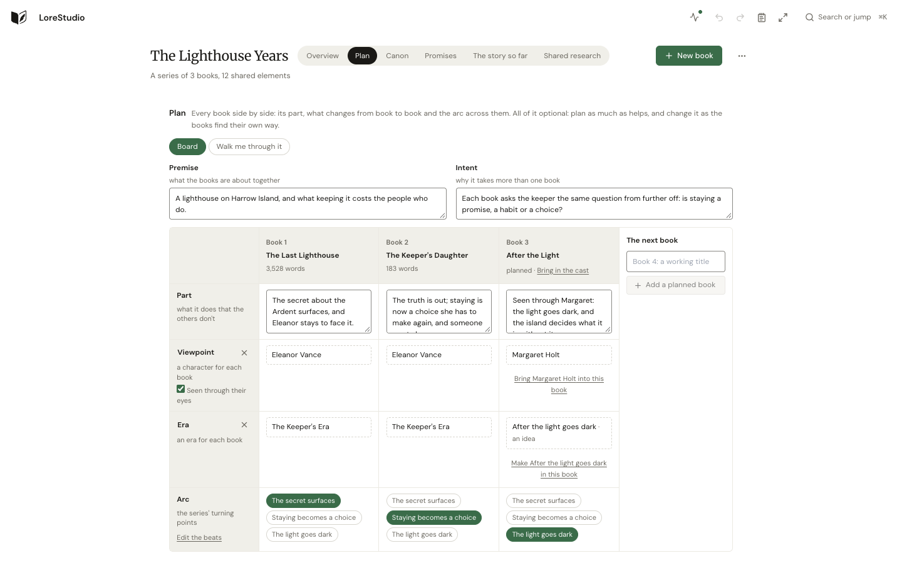

# Screenshots

Taken from the demo stories by `just screenshots`, in the Zen palette; each follows your light or dark setting.

## The dashboard

Every story, with a series' books together.

<a href="images/screenshots/dashboard-light.png">
  <picture>
    <source media="(prefers-color-scheme: dark)" srcset="images/screenshots/dashboard-dark.png" />
    
  </picture>
</a>

## Writing

The story strip, the prose, and the scene's plan and findings beside it.

<a href="images/screenshots/write-light.png">
  <picture>
    <source media="(prefers-color-scheme: dark)" srcset="images/screenshots/write-dark.png" />
    
  </picture>
</a>

## The Overview

Where you left off, what needs your eye, the book's vitals and who is in it.

<a href="images/screenshots/overview-light.png">
  <picture>
    <source media="(prefers-color-scheme: dark)" srcset="images/screenshots/overview-dark.png" />
    
  </picture>
</a>

## Findings

What the checks noticed, by place in the story; each opens the scene at the words.

<a href="images/screenshots/findings-light.png">
  <picture>
    <source media="(prefers-color-scheme: dark)" srcset="images/screenshots/findings-dark.png" />
    
  </picture>
</a>

## A character's sheet

Who they are, the three questions, and what needs your eye about them.

<a href="images/screenshots/character-light.png">
  <picture>
    <source media="(prefers-color-scheme: dark)" srcset="images/screenshots/character-dark.png" />
    
  </picture>
</a>

## Promises

The tapestry: threads, twists and setups across the book.

<a href="images/screenshots/promises-light.png">
  <picture>
    <source media="(prefers-color-scheme: dark)" srcset="images/screenshots/promises-dark.png" />
    
  </picture>
</a>

## Numbers

Words, pacing, who is on the page and how the prose reads, across the whole book.

<a href="images/screenshots/numbers-light.png">
  <picture>
    <source media="(prefers-color-scheme: dark)" srcset="images/screenshots/numbers-dark.png" />
    
  </picture>
</a>

## A series' plan

Each book's part, the people who carry the series, its eras and its arc.

<a href="images/screenshots/series-plan-light.png">
  <picture>
    <source media="(prefers-color-scheme: dark)" srcset="images/screenshots/series-plan-dark.png" />
    
  </picture>
</a>
